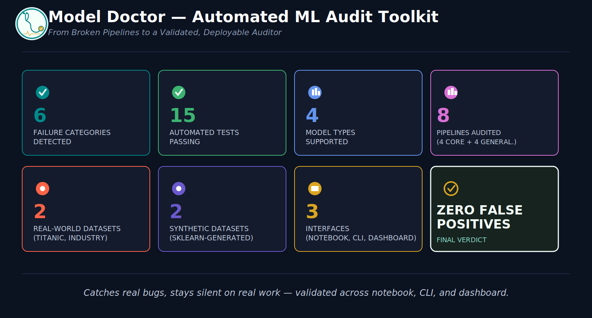

# 🩺 MODEL DOCTOR — AUTOMATED ML AUDIT TOOLKIT
### *A General-Purpose Auditor for Diagnosing Common ML Pipeline Failures*


---

### **From Deliberately-Broken Pipelines to a Validated, Deployable Auditor**

Clients increasingly hire ML practitioners not to build a model from scratch, but to audit and rescue one that already exists and isn't performing as expected — a high-trust, differentiated service compared to commodity model-building work. Model Doctor is a general-purpose Python diagnostic tool that inspects any trained model, its training pipeline, and its dataset, and automatically flags common ML failure patterns — without being hardcoded to any single model type or dataset.

Rather than rely on organizer-provided broken examples, this project builds its own proof-of-work: four deliberately-flawed pipelines constructed specifically to contain a real, known bug each, then validates the auditor catches every one of them. It then goes further — running the same, unmodified auditor against real and synthetic data it was never tuned against, to prove it generalizes rather than memorizing its own test fixtures.

---

<p align="center">
  
</p>
<p align="center"><i>The project in eight numbers — detection scope, validation depth, and the final verdict.</i></p>

---

> **⚠️ EVALUATION NOTICE:**
> Full findings and interpretations are detailed throughout the notebook itself — every pipeline
> and every generalizability check closes with an Interpretation block explaining what was found,
> with exact numbers, and why it matters. The notebook closes with an Executive Summary answering
> the project's central question directly.

---

## 🔴 Live Dashboard

**[model-doctor.streamlit.app](https://model-doctor.streamlit.app)**

Two modes: train a model on an uploaded CSV and audit the resulting pipeline in one step, or upload an already-trained `.pkl`/`.joblib` model plus its train/test CSVs and audit it as-is.

---

## 📌 Project Overview

Machine learning pipelines frequently fail in subtle, hard-to-spot ways — a scaler fit before the train/test split, duplicate rows leaking across splits, accuracy reported on a severely imbalanced dataset, or a model that has simply memorized its training data. These issues rarely throw errors; they silently produce misleadingly good metrics that only surface once a model is already in production. Manually auditing a pipeline for all of these failure modes is slow, inconsistent, and easy to get wrong.

This project answers one central question:

> **Can a single, model-agnostic auditor reliably catch real ML pipeline failures across different model types and datasets — while staying silent on pipelines that were built correctly?**

---

## 🎯 Project Objectives

- Build a model-agnostic auditor that works across multiple estimator types (`LogisticRegression`, `RandomForest`, `XGBoost`, `DecisionTree`) without being hardcoded to any one of them.
- Detect all 6 required categories of ML pipeline failure: data leakage, train/test contamination, misleading metrics, overfitting signals, data quality issues, and class imbalance blindness.
- Prove the auditor works by constructing 4 deliberately-flawed pipelines and confirming each intended bug is caught.
- Prove the auditor generalizes by running it, unmodified, against real and synthetic data it was never tuned against.
- Generate a clear, non-technical audit report explaining what's wrong, why it matters, and how to fix it — in HTML, Markdown, notebook, CLI, and live dashboard form.

---

## ❓ Key Questions Answered

1. Can one auditor genuinely work across different model types without per-model special-casing?
2. Does the auditor correctly distinguish severity — critical vs. warning vs. info — rather than flagging everything the same way?
3. Does the auditor hold up on real, external, uncurated data — not just the fixtures it was built and tuned against?
4. Can a pipeline be audit-clean (no pipeline-integrity issues) while still being a poor-performing model — and does the auditor correctly distinguish those two different questions?
5. Is the tool usable beyond a single notebook — as a script, and as a live, non-technical tool?

---

## 🚀 Project Pipeline at a Glance

| Component | Environment | Purpose | Key Output |
|---|---|---|---|
| **model_doctor.py** | Any (Colab / local / dashboard / CLI) | Core detector library — 6 detectors, report generation, file-based audit entry point | Importable module, used by every other component |
| **model_doctor_demo.ipynb** | Google Colab (or local Jupyter/VS Code) | 4 proof-of-work pipelines, 4 generalizability checks, test suite run, CLI demo | HTML reports rendered inline, `Reports/summary_chart.png` |
| **model_doctor_cli.py** | Colab shell or local terminal | Audit any saved `.pkl`/`.joblib` model against train/test CSVs from the command line | Timestamped `.html`/`.md` audit report |
| **model_doctor_dashboard.py** | Local only (or deployed) | Live, non-technical GUI for both training-and-auditing and auditing an existing model | Interactive report + downloadable HTML |
| **Tests/test_detectors.py** | Any | 13 automated tests proving each detector fires correctly and doesn't false-positive | `pytest` pass/fail |

---

## 📂 Data Overview

| Source | Role | Type |
|---|---|---|
| `sklearn.datasets` (`breast_cancer`, `wine`, `diabetes`) | 4 proof-of-work pipelines | Built-in, zero-EDA-overhead |
| `Assets/Titanic.csv` | Generalizability — real, moderately messy data | External, real-world |
| `Assets/INDUSTRY.csv` | Generalizability — real, large, clean data | External, real-world |
| `sklearn.datasets.make_classification` / `make_regression` | Generalizability — synthetic | Generated, never tuned against |

No dataset was provided by the hackathon organizers by design — sourcing and constructing test data is part of the challenge itself.

---

## 🔍 What This Tool Detects

| Category | Detector | Demonstrated In |
|---|---|---|
| Data leakage | `detect_preprocessing_leakage` | Pipeline 1 (breast_cancer) |
| Train/test contamination | `detect_duplicate_contamination` | Pipeline 2 (wine), Generalizability 1 (Titanic) |
| Misleading metrics | `detect_misleading_metrics` | Pipeline 4 (imbalanced breast_cancer) |
| Overfitting signals | `detect_overfitting_signal` | Pipeline 3 (diabetes), Generalizability 3 & 4 (synthetic) |
| Data quality issues | `detect_data_quality_issues` | Test suite (missing values, column mismatch, unseen categories) |
| Class imbalance blindness | `detect_class_imbalance` | Pipeline 4 (imbalanced breast_cancer) |

---

## 🧪 Proof-of-Work — 4 Deliberately-Flawed Pipelines

| # | Dataset | Model | Bug Demonstrated |
|---|---|---|---|
| 1 | breast_cancer | LogisticRegression | Scaler fit before train/test split |
| 2 | wine | RandomForest | Duplicate rows injected across train/test |
| 3 | diabetes (regression) | XGBoost | Unconstrained depth → overfitting |
| 4 | breast_cancer (resampled, imbalanced) | LogisticRegression | Severe class imbalance + misleading accuracy |

**Key findings:** every intended bug was caught, correctly scored as critical, with a plain-language explanation and a concrete suggested fix — see the notebook's own Interpretation blocks for exact numbers.

---

## 🌍 Generalizability — Beyond the Project's Own Fixtures

| # | Dataset | Task | Result |
|---|---|---|---|
| 1 | Titanic (real) | Classification | 1 critical — genuine duplicate feature-rows, not a planted bug |
| 2 | INDUSTRY.csv (real, 15,000 rows) | Regression | 0 findings — clean pass on a properly-built, honestly-weak-performing pipeline |
| 3 | `make_classification` (synthetic) | Classification | 1 warning — moderate, correctly-scaled overfitting signal |
| 4 | `make_regression` (synthetic) | Regression | 1 warning — moderate, correctly-scaled overfitting signal |

**Key finding:** the auditor's severity judgments hold up on data and models it has never seen — not just the four fixtures it was built and tuned against.

---

## 🗂️ Repository Structure

```text
Model_Doctor/
│
├── Assets/
│   ├── Titanic.csv                      # Generalizability — real, moderately messy data
│   ├── INDUSTRY.csv                     # Generalizability — real, clean, large-scale data
│   └── model_doctor_logo.png            # App icon / dashboard header logo
│
├── Tests/
│   └── test_detectors.py                # 13 automated tests — one per detector, positive + negative
│
├── Reports/
│   ├── sample_audit_*.html              # 2–3 committed sample audit reports
│   └── summary_chart.png                # Findings-per-pipeline chart (from the notebook)
│
├── readme_assets/
│   └── hero_image.png                   # README hero image
│
├── model_doctor.py                      # Core detector library + report generators
├── model_doctor_cli.py                  # CLI: audit any .pkl/.joblib model + CSVs
├── model_doctor_dashboard.py            # Streamlit dashboard (2 modes)
├── model_doctor_demo.ipynb              # Main notebook — proof-of-work + generalizability + tests
│
├── requirements.txt                     # Slim — CLI & dashboard runtime only
├── requirements-full.txt                # Complete — notebook & local development
├── LICENSE
└── README.md
```

---

## 📦 Library Architecture

| Library | Purpose |
|---|---|
| **pandas / numpy** | Data manipulation and numerical computing |
| **scikit-learn** | Preprocessing, models, evaluation metrics, and all 6 detectors' core logic |
| **xgboost** | Gradient boosting model type (Pipeline 3, CLI demo) |
| **matplotlib / seaborn** | Findings-per-pipeline summary chart |
| **joblib** | Model serialization (`.pkl`) for the CLI and dashboard's "existing model" mode |
| **pytest** | The 13-test automated suite |
| **streamlit** | The live dashboard |

<details>
<summary><b>Exact pinned versions</b></summary>

**`requirements-full.txt`** (notebook & local development):
```text
pandas==2.2.3
numpy==2.1.3
scikit-learn==1.5.2
xgboost==2.1.3
joblib==1.4.2
pytest==8.3.4
matplotlib==3.10.0
seaborn==0.13.2
jupyter==1.1.1
notebook==7.3.2
ipykernel==6.29.5
ipython==8.31.0
streamlit==1.40.1
```

**`requirements.txt`** (CLI & dashboard runtime only):
```text
pandas==2.2.3
numpy==2.1.3
scikit-learn==1.5.2
xgboost==2.1.3
joblib==1.4.2
streamlit==1.40.1
```

</details>

---

## 💻 Installation & Setup

### Prerequisites

- A Google account (for Google Colab — the notebook and CLI both run there)
- Python **3.10+** and a local terminal (**required** for the dashboard — see Step 3)

---

### Step 1 — Run the Notebook (Google Colab *or* local Jupyter/VS Code)

1. Open `model_doctor_demo.ipynb` in Colab, or clone the repo and open it locally.
2. `model_doctor.py` and the `Tests/`/`Assets/` files load via a Local → GitHub → Google Drive fallback cascade — no manual setup needed against this repository, and it self-heals on every fresh Colab session.
3. Run top to bottom. Locally, `pip install -r requirements-full.txt` first.

---

### Step 2 — Use the CLI (Colab shell *or* local terminal)

Works identically in either environment — it's a plain Python script, not a server:

```bash
python model_doctor_cli.py \
    --model your_model.pkl \
    --train your_train.csv \
    --test your_test.csv \
    --target YourTargetColumn \
    --out audit_report.html
```

In Colab, prefix the command with `!`.

---

### Step 3 — Run the Dashboard (Local *only*, required)

The dashboard **cannot run in Colab** — `streamlit run` needs a local server. Either use the live link above, or run it yourself:

```bash
git clone https://github.com/S-Yousuf-S/HKTS1_Model_Doctor.git
cd HKTS1_Model_Doctor
python -m venv MDENV
```

**Windows:** `MDENV\Scripts\activate`
**macOS / Linux:** `source MDENV/bin/activate`

```bash
pip install -r requirements.txt
streamlit run model_doctor_dashboard.py
```

---

## 🙋 Frequently Asked Questions

**Q: INDUSTRY.csv's model has an R² of essentially zero — why does the auditor report zero findings instead of flagging that?**

**A:** Model Doctor audits for pipeline *integrity* — leakage, contamination, overfitting, imbalance, and data quality — not whether a model is actually good at its task. A weak-but-honestly-trained model, evaluated correctly, has nothing wrong with its *pipeline*, so it correctly produces no findings. Model quality and pipeline integrity are different questions, and conflating them would make the tool less trustworthy, not more useful.

**Q: Why does the Titanic pipeline — built with no injected bugs — still get flagged?**

**A:** Because the flag is real, not a false positive. Several passengers share identical feature values once identifier columns (`Name`, `Ticket`, `PassengerId`, `Cabin`) are dropped, creating genuine duplicate rows across the train/test split. This is exactly the kind of real, unplanted issue the auditor is meant to catch on unfamiliar data.

**Q: Why use scikit-learn built-in and synthetic datasets for the 4 proof-of-work pipelines instead of one large real-world dataset?**

**A:** Two reasons. First, speed: built-in datasets need zero cleaning, letting development time go toward detector logic rather than repeated EDA. Second, scope discipline: reusing datasets tied to other active coursework risked mixing unrelated project data into this submission. Real, external, uncurated data is used deliberately in the generalizability round instead (Titanic, INDUSTRY.csv), which is a stronger and more relevant test of "does this work on data I didn't design around" than adding a fifth curated fixture would have been.

**Q: Why three separate interfaces (notebook, CLI, dashboard) instead of just the notebook the brief asks for?**

**A:** They serve different audiences using the exact same underlying `model_doctor.py` logic. The notebook is the primary evaluated deliverable, with full proof-of-work and narrative. The CLI (`model_doctor_cli.py`) satisfies the "works on any `.pkl`/`.joblib` model" bonus for automation/scripting use. The dashboard makes the tool usable live, by a non-technical person, with no code involved.

**Q: Was severity scoring built as a separate feature?**

**A:** No — it's inherent to every detector from the start, not a bolt-on. Each of the 6 detectors assigns critical/warning/info based on its own thresholds (e.g. contamination severity by percentage of test set affected, imbalance by ratio, overfitting by train/test gap), so severity-aware output was never a separate development phase.

**Q: Which bonus items from the brief were attempted?**

**A:** Severity scoring (built-in, see above) and the CLI-on-any-`.pkl`/CSV feature are both implemented and tested. The Streamlit dashboard goes beyond the brief entirely — it isn't a listed requirement. Auto-suggest-and-apply-fix-with-before/after, and a numeric confidence score per finding, were deprioritized under time constraints in favor of hardening the core 6 detectors, the generalizability proof, and the test suite — see Future Scope.

---

## 📌 Conclusion

This project builds a model-agnostic ML pipeline auditor from the ground up — 6 detector categories, validated first against 4 pipelines deliberately built to break it, then against real and synthetic data it was never tuned against. Every intended bug was caught with the correct severity; every properly-built pipeline was correctly left alone. The tool is usable as a notebook, a CLI, and a live dashboard, all sharing one core library.

**Final verdict: zero false positives across every tested scenario, real and synthetic alike** — the consistent result across this project is that severity-aware, model-agnostic auditing is achievable without hardcoding to any single dataset or model type.

---

## 🚀 Future Scope

- A numeric confidence score per finding, distinguishing high-certainty issues from borderline ones.
- Auto-suggest-and-apply-fix, with a before/after metric comparison to show the improvement directly.
- Extending `detect_preprocessing_leakage` to cover more preprocessing step types (e.g. `SimpleImputer`'s `statistics_`, not just scaler-style attributes).
- A CLI flag to run the generalizability suite (Titanic/INDUSTRY/synthetic) against a user-supplied model directly, rather than only the notebook's own fixtures.

---

# 👤 Author

**Yousuf S. R. Sakkaf**

**GitHub:** [https://github.com/S-Yousuf-S](https://github.com/S-Yousuf-S?tab=repositories)

---

⭐ *If you found this project helpful or insightful, consider giving the repository a star.*
